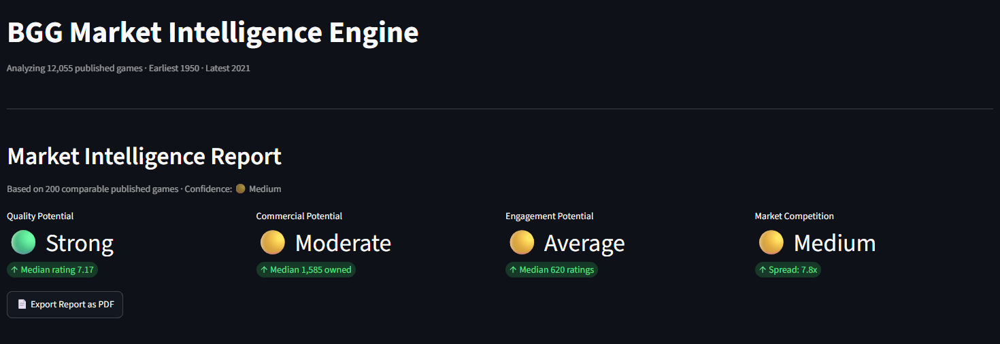
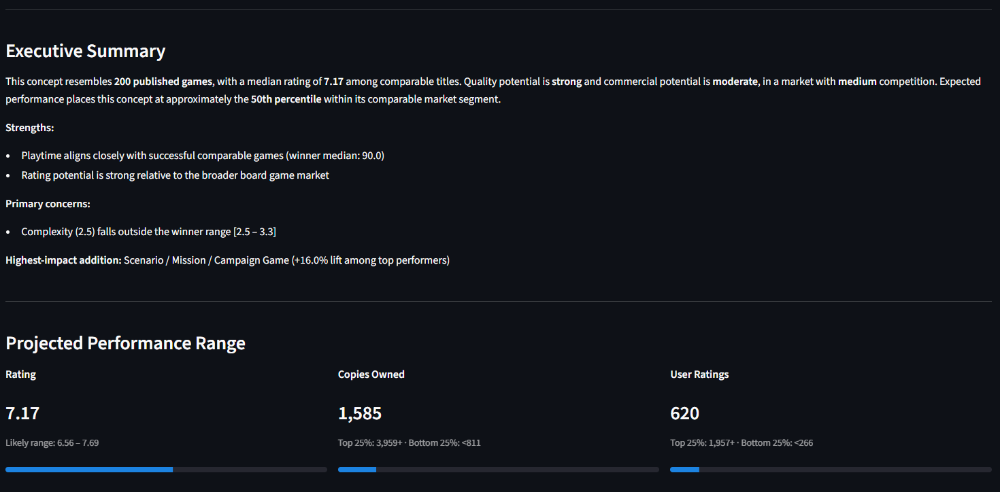
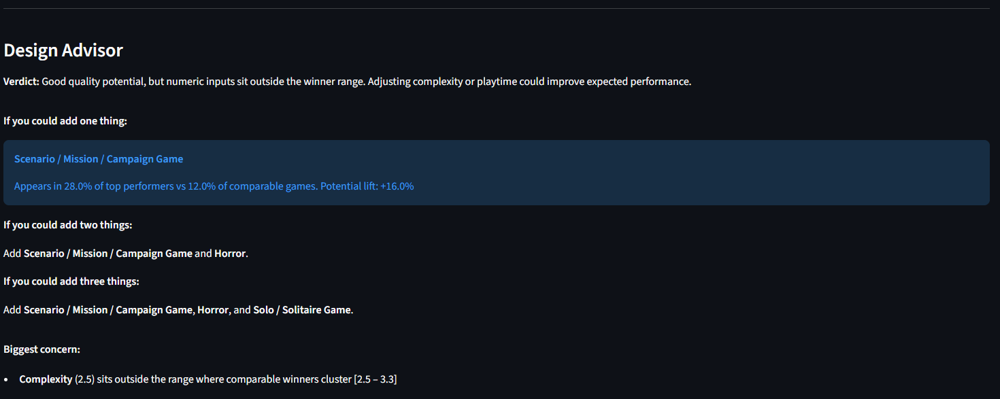
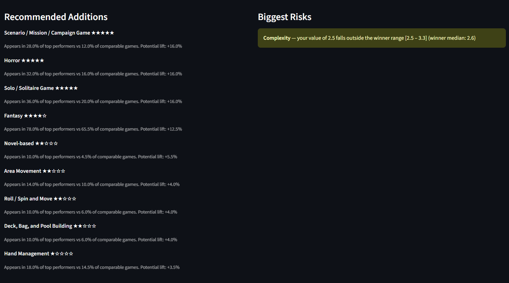
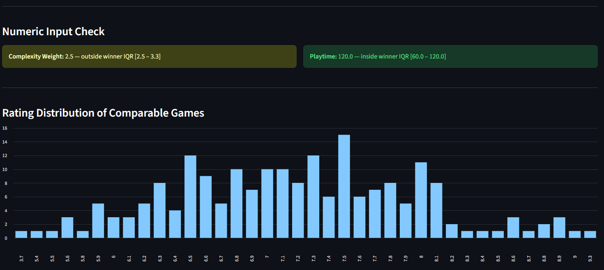
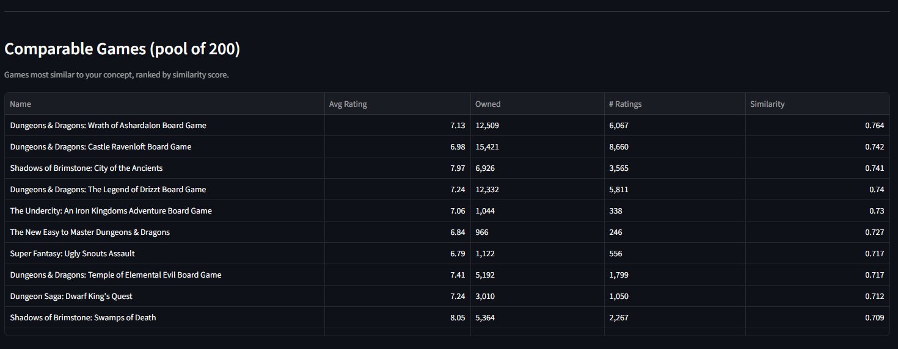
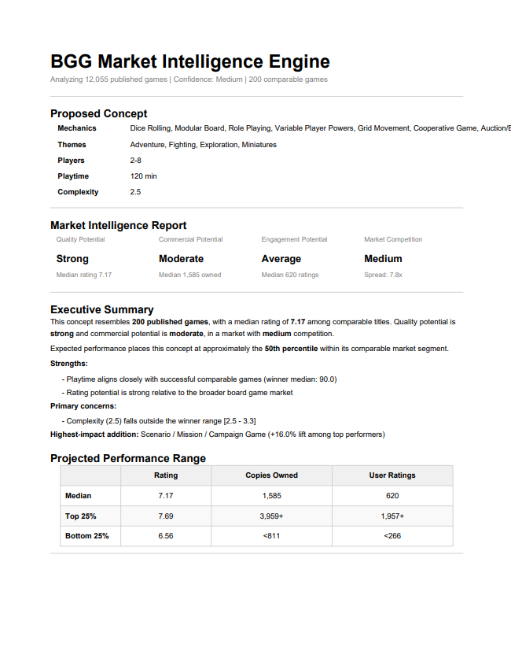
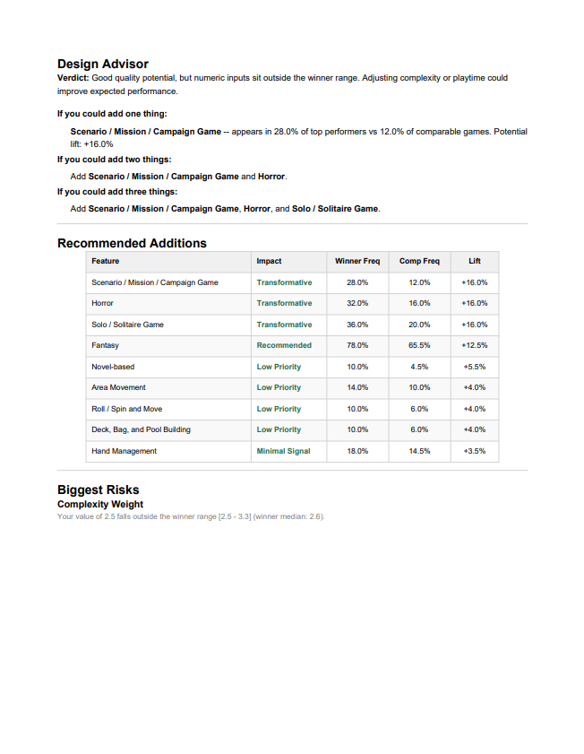
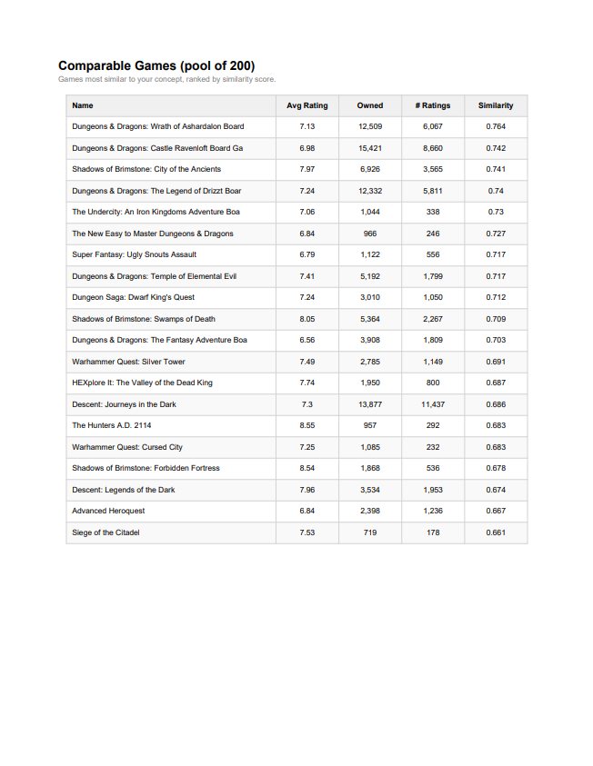

# BGG Market Intelligence Engine

A Streamlit application for evaluating board game concepts against historical BoardGameGeek data.

Given a proposed game's mechanics, themes, complexity, playtime, and player count, the engine:

* Finds comparable published games
* Projects likely rating, ownership, and engagement ranges
* Identifies features associated with stronger-performing comparable games
* Flags features associated with weaker-performing comparable games
* Checks whether complexity and playtime align with successful titles in the same space
* Generates a shareable PDF report

The goal is not to predict whether a game will succeed. The goal is to provide a market-grounded reference point when comparing concepts or evaluating design decisions.

---

## Example Questions

* How do games similar to this typically perform?
* Is this concept entering a crowded market?
* What mechanics appear frequently among successful comparable games?
* Are there features in my concept that are associated with weaker outcomes?
* Is my planned complexity or playtime outside the range where comparable winners tend to cluster?

---

## Dashboard Example













---

## Sample PDF Report







---

## Methodology

### Comparable Game Selection

Every game in the dataset is scored against the proposed concept using a weighted similarity score.

| Dimension           | Weight |
| ------------------- | ------ |
| Mechanics           | 50%    |
| Themes / Categories | 15%    |
| Complexity Weight   | 15%    |
| Playtime            | 10%    |
| Player Count        | 10%    |

Mechanics receive the highest weighting because they generally define the gameplay experience more strongly than theme alone.

Mechanic and theme similarity are calculated using Jaccard similarity. Complexity and playtime use normalized distance scoring. Player count uses range overlap.

The engine returns the top N most similar games as the comparable pool.

---

### Success Score

Comparable games are ranked using a blended success score:

* Rating (40%)
* Ownership (40%)
* User Ratings / Engagement (20%)

The comparable pool is then divided into:

* Winners (top 25%)
* Bottom performers (bottom 25%)

These groups are used to identify positive drivers and risks.

---

### Positive Drivers

Positive drivers are features that:

* Are not currently part of the proposed concept
* Appear more frequently among winners than among the comparable pool overall

Drivers are ranked by lift:

```text
Winner Frequency - Comparable Pool Frequency
```

---

### Risks

Risks are features already present in the concept that appear more frequently among bottom performers than winners.

The goal is not to declare a mechanic "bad," but to identify features that may warrant closer examination within a specific design space.

---

### Numeric Checks

The engine compares proposed:

* Complexity
* Playtime

against the interquartile range of winners in the comparable pool.

Values outside that range are flagged for review.

---

## Tech Stack

* Python
* Pandas
* NumPy
* SQLite
* Streamlit
* ReportLab

---

## Project Structure

```text
bgg_engine/
│
├── data/
│   ├── games.csv
│   ├── mechanics.csv
│   ├── themes.csv
│   ├── subcategories.csv
│   └── bgg.db
│
├── app.py
├── main.py
├── export_pdf.py
├── setup_db.py
├── query_main.sql
├── query_summary.sql
└── README.md
```

---

## Setup

### Dataset

The source dataset is not included in this repository.

Download the BoardGameGeek dataset from Kaggle and place the following files in the `data/` directory:

* games.csv
* mechanics.csv
* themes.csv
* subcategories.csv

### Install Dependencies

```bash
pip install pandas numpy streamlit reportlab
```

### Build Database

```bash
python setup_db.py
```

### Run Application

```bash
streamlit run app.py
```

---

## Using the Application

1. Select mechanics, themes, and subcategories
2. Enter player count, playtime, and complexity
3. Select a comparable pool size
4. Run analysis
5. Review results in the dashboard
6. Export a PDF report if desired

---

## Data Source

BoardGameGeek dataset via Kaggle.

The working dataset is filtered to:

* Year Published >= 1950
* NumUserRatings >= 50
* NumOwned >= 100

Resulting dataset size is approximately 12,000 games.

---

## Limitations

* Dataset is a January 2022 snapshot
* Similarity is based on recorded metadata, not subjective gameplay feel
* Results are correlational, not causal
* Small comparable pools produce lower-confidence estimates
* Ownership data reflects the BoardGameGeek community rather than the broader board game market

---

## Future Work

Potential future enhancements:

* Release-year normalization
* Trend weighting
* Publisher analysis
* Market saturation analysis
* Scenario testing
* Additional forecasting models
